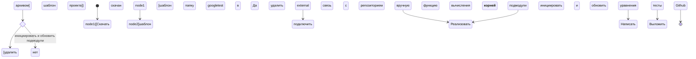

# Примеры диаграмм на Mermaid

## Литература и справочные руководства
* https://mermaid.js.org/
* https://plantuml.com/

## Диаграмма активности
* Документация: https://plantuml.com/ru/activity-diagram-beta
* Онлайн генерация

* [оффлайн файл](diagrams/activity.puml)

