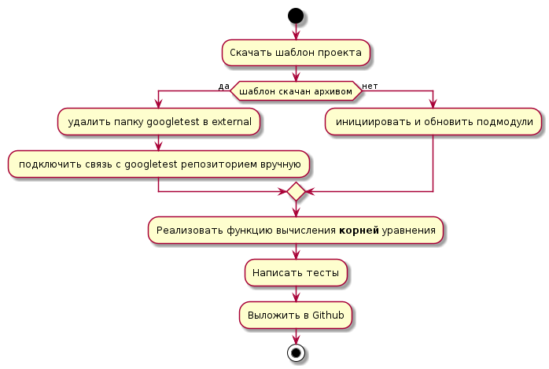

# Примеры диаграмм на Mermaid/PlantUML

## Литература и справочные руководства
* https://mermaid.js.org/
* https://plantuml.com/
* https://habr.com/ru/articles/652867/

## Диаграмма активности (Activity diagram)
* Документация: https://plantuml.com/ru/activity-diagram-beta
* Онлайн генерация (формат mermaid, используется инструмент Диаграммы состояний)

* [оффлайн файл](diagrams/activity.puml)

## Диаграмма состояний (State Machine diagram)

* Онлайн генерация (формат mermaid)

* [оффлайн файл](diagrams/state-machine.puml)

## Диаграмма последовательности (Sequence diagram)

* Документация: https://mermaid.js.org/syntax/sequenceDiagram.html
* Онлайн генерация (формат mermaid)

* [оффлайн файл](diagrams/sequence.puml)
* Документация: https://plantuml.com/ru/sequence-diagram

